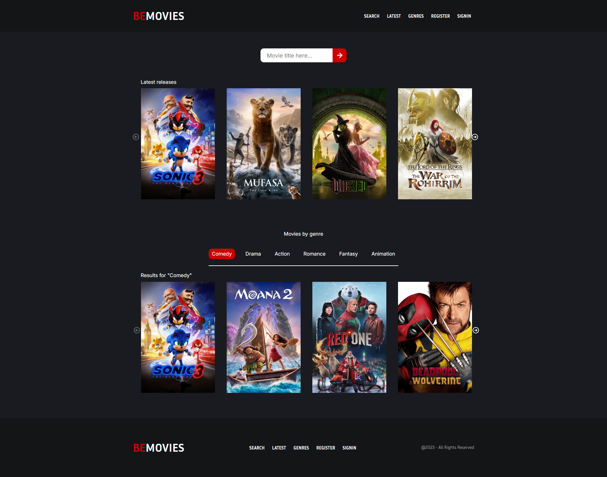
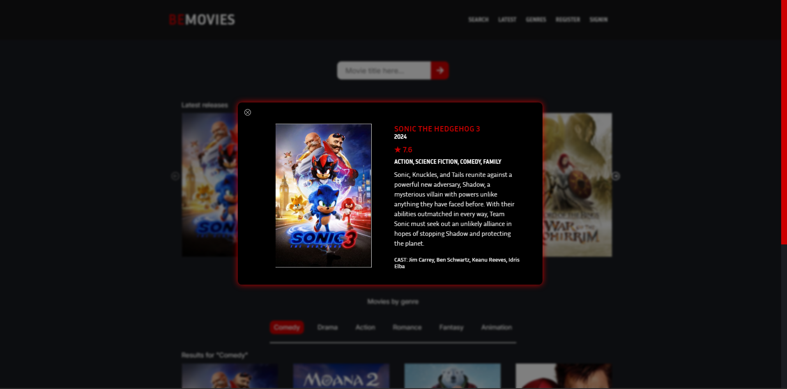

<h1 align="center"> 🎬 BeMovies 🎬 </h1>

### 🌐 Demo / Preview



---

### ✏️ **Description**
BeMovies is a collaborative project developed by a team of two. The project is split into two main parts:
1. A **pixel-perfect front-end** based on a Figma design provided by our coach.
2. A **precise API implementation**, meeting several specific functional requirements, including:
   - Displaying a movie swiper only when a search is active; otherwise, the section below adjusts to sit just under the search bar.
   - Showing additional information when hovering over a movie poster.
   - Revealing detailed information when clicking on a movie poster.
   - Allowing user registration/login through a shared modal.
   - And more...

This collaboration provided an excellent opportunity to share ideas, tackle challenges together, and foster a motivating team dynamic for advancing the project.

### 💻 **Technologies Used**
- **HTML5**: For structuring the content of the page.
- **SCSS**: For styling and maintaining clean and organized stylesheets.
- **JavaScript**: For handling API calls, interactivity, and dynamic data rendering.

### **Key Features** 🚀
🎯 **Pixel-perfect design**: Front-end built meticulously to match the Figma design.

🔗 **API integration**: Includes precise and functional API calls for dynamic data handling.

🌀 **Dynamic movie swiper**: Appears only when a search is active, adjusting the layout accordingly.

🖱️ **Interactive posters**: Hovering reveals basic info; clicking displays detailed information.

🔑 **User authentication**: Login and registration managed through a shared modal.

👥 **Team collaboration**: Encouraged sharing of ideas and approaches, enhancing project quality and team cohesion.

### 🛠️ **Installation & Usage**
1. Clone the repository:
   ```bash
   git clone https://github.com/HUYBERIC/BeMovies.git
   cd BeMovies
   ```

2. Open `index.html` in your favorite browser to view the application.

<br>
<br>
<br>

---

<h1 align="center"> 🎬 BeMovies 🎬 </h1>

---

### ✏️ **Description**
BeMovies est un projet collaboratif réalisé en binôme. Le projet se divise en deux grandes parties :
1. Un **front-end pixel-perfect** basé sur une maquette Figma fournie par notre coach.
2. Une **intégration API précise**, respectant des attentes fonctionnelles bien définies, telles que :
   - Afficher un carrousel de films uniquement si une recherche est en cours, sinon la section suivante se place juste sous la barre de recherche.
   - Afficher des informations supplémentaires au survol d'une affiche de film.
   - Afficher encore plus de détails lors du clic sur une affiche.
   - Permettre à l'utilisateur de s'inscrire/se connecter via une modale commune.
   - Et bien plus...

Cette collaboration a été une expérience enrichissante pour confronter nos visions respectives, s'entraider face aux défis et renforcer la cohésion d'équipe, motivant ainsi l'avancée du projet.

### 💻 **Technologies utilisées**
- **HTML5** : Pour structurer le contenu de la page.
- **SCSS** : Pour le style et l'organisation des feuilles de style.
- **JavaScript** : Pour les appels API, l’interactivité et le rendu dynamique des données.

### **Caractéristiques principales** 🚀
🎯 **Design pixel-perfect** : Front-end développé avec soin pour correspondre parfaitement à la maquette Figma.

🔗 **Intégration API** : Appels API précis pour gérer les données dynamiques.

🌀 **Carrousel dynamique de films** : Apparaît uniquement en cas de recherche, ajustant la mise en page.

🖱️ **Affiches interactives** : Survol pour afficher des informations basiques; clic pour des détails complets.

🔑 **Authentification utilisateur** : Connexion et inscription gérées via une modale commune.

👥 **Travail collaboratif** : Permet de partager des idées et des approches, tout en renforçant la qualité et la dynamique de groupe.

### 🛠️ **Installation & Utilisation**
1. Cloner le dépôt :
   ```bash
   git clone https://github.com/HUYBERIC/BeMovies.git
   cd BeMovies
   ```

2. Ouvrir `index.html` dans votre navigateur favori pour utiliser l'application.
